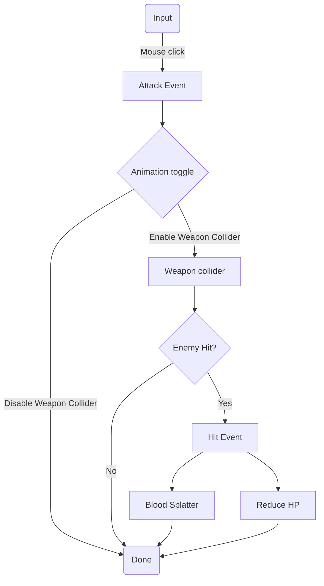

# Convert 3D third person sample to Multiplayer
## Unity Netcode, Lobby, Relay

Install Netcode, Lobby, Relay *(Window - Package Manager)* then install ParrelSync

(if Visual Studio does not regognize Netcode, then open Unity - Preferences - External editors - Uncheck everything - Regenerate project files - Check everything - Regenerate project files)

- Open Prefabs folder, drag PlayerArmeture to prefabs folder and create Original Prefab
- Rename it NetworkPlayer (or anything you like) and open the prefab
- Drag the MainCamera and PlayerFollowCamera prefabs into the NetworkPlayer so each player spawns its own camera
- Disable all components in MainCamera and PlayerFollowCamera (we will enable them again only for the owner)
- Open PlayerFollowCamera and drag the PlayerCameraRoot gameobject into the Follow slot inside the Inspector

- Open the Scripts folder and duplicate ThirdPersonController and rename it NetworkThirdPersonController
- Add the NetworkThirdPersonController to the NetworkPlayer gameobject and disable all components except Animator and Character Controller (we will enable input for only the owner)
- Add NetworkObject and ClientNetworkTransform components to the NetworkPlayerArmeture
- Add a NetworkManager to a new gameobject and add Unity Transport - Drag Networkplayer to the Player slot and Network Prefabs slot

- Create a new script inside the NetworkPlayer prefab and call it PlayerStart
- Enable the disabled components inside NetworkPlayer if IsOwner

- Open NetworkThirdPersonController script
- Make MainCamera public instead of private
- Edit the NetworkPlayer prefab and drag the MainCamera into the slot in the NetworkThirdPersonController
- In the Inspector of the NetworkThirdPersonController component set 'Default, Ground' as ground layers, and select a audio clips (footsteps, landing)

- Open StarterAssetsInputs script, replace MonoBehaviour with NetworkBehavior - and add  `if(!IsOwner) return;` to all methods

- Create a NetworkAnimation, add a public CharacterController and drag the Controller and Animator to the slots
- Get the speed of the remote player, check if his controller is grounded, and add Animations based on the controller

# Combat system

